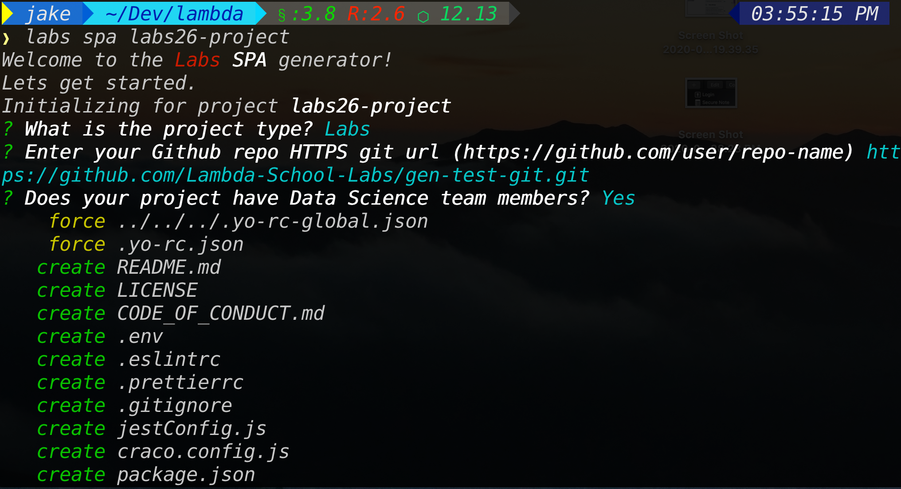

# Labs Basic SPA Generator

The Labs SPA generator will create a [basic cra react app](https://docs.labs.lambdaschool.com/labs-spa-starter/) with configuration and
components in place based on answers to the prompts. Common elements found in
all configurations are:

- [Labs opinionated](https://docs.labs.lambdaschool.com/labs-spa-starter/components) project structure
- example page/common components
- [Working tests](https://docs.labs.lambdaschool.com/labs-spa-starter/testing) for components using jest and React Testing Library
- Labs defined eslint and pretter config
- github ci/actions workflow config
- git hook enforced linting using Husky

## CLI Examples

Create a SPA app for the labs 27 gigantic product

`labs spa labs27-gigantic`

Create a SPA app for the Labs 26 gigantic product with the `labs` program option

`labs spa labs26-gigantic --program=labs`

When only the project name argument is provided then you will be prompted
for more info.



## Usage

``` bash
Usage:
  labs spa:app <name> [options]

Options:
  -h,   --help           # Print the generator's options and usage
        --skip-cache     # Do not remember prompt answers                                                                     Default: false
        --skip-install   # Do not automatically install dependencies                                                          Default: false
        --force-install  # Fail on install dependencies error                                                                 Default: false
        --ask-answered   # Show prompts for already configured options                                                        Default: false
  -p,   --program        # Which program will this be used for: "bw" or "labs"
  -r,   --repoUrl        # The Github repo HTTPS git url. eg, https://github.com/lambda-school-labs/labsNN-productA-teamB-fe
  -d,   --hasDS          # project has DS team members

Arguments:
  name  # Name of Project  Type: String  Required: true
```

## Prompts / Options

The following prompts will provide additional configuration and examples

### Does your team have Data Science members

#### Option

`--hasDS` or `-d` - passing `false` to the option will turn it off. (`--hasDS=false`)

#### Prompt

If the answer is `Y` then the following items will be added to the project:

- modules `plotly.js` and `react-plotly.js`
- an example data visualization page component `ExampleDataViz` using a DS API.

### Program

#### Option

`--program` or `-p` - pass `labs` or `bw`

#### Prompt

The program choices are `BW` and `Labs`

- `BW` will generate the base configuration.
- `Labs` will add the following elements
  - Okta identity management service
  - Secure routes using Okta library
  - Secure BE API example using Okta JWT
  - [Ant Design](https://docs.labs.lambdaschool.com/labs-spa-starter/styling-with-ant-design) configuration and theme
  - [Storybook](https://docs.labs.lambdaschool.com/labs-spa-starter/storybook) documentation
  - [AWS Amplify](https://docs.labs.lambdaschool.com/labs-spa-starter/untitled) config file

## Enter your Github repo HTTPS git url

#### Option

`--repoUrl` or `-r` - leave empty (`-r`) to turn off

#### Prompt

This is the git https url (eg https://github.com/Lambda-School-Labs/gen-test-git.git)

When this value is provided then the generator will do the following:

- init the git repo with this URL as the remote
- create a main branch
- stage and commit the generated files
- push the branch to github
